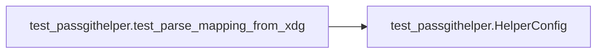
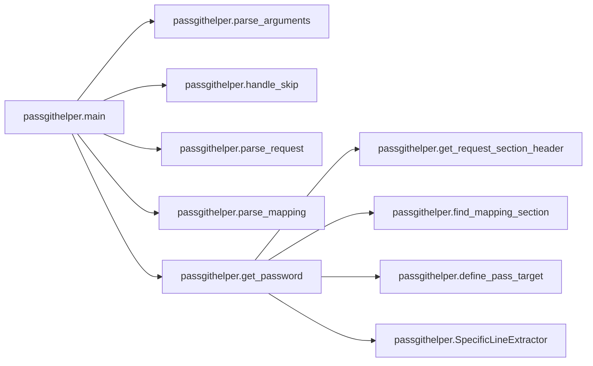
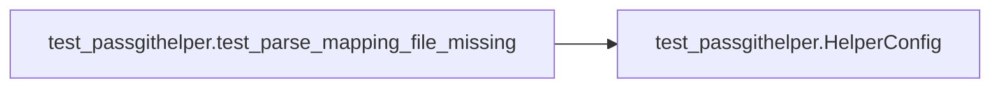
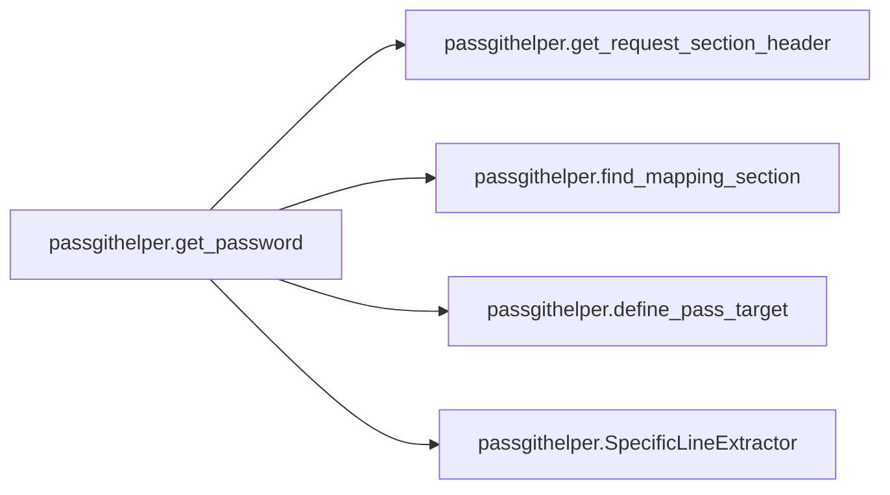

# Key Objects

[_Documentation generated by Documatic_](https://www.documatic.com)

<!---Documatic-section-passgithelper.define_pass_target-start--->
## passgithelper.define_pass_target

<!---Documatic-section-define_pass_target-start--->
<!---Documatic-block-passgithelper.define_pass_target-start--->
<details>
	<summary><code>passgithelper.define_pass_target</code> code snippet</summary>

```python
def define_pass_target(section: configparser.SectionProxy, request: Mapping[str, str]) -> str:
    pass_target = section.get('target').replace('${host}', request['host'])
    if 'username' in request:
        pass_target = pass_target.replace('${username}', request['username'])
    return pass_target
```
</details>
<!---Documatic-block-passgithelper.define_pass_target-end--->
<!---Documatic-section-define_pass_target-end--->

# #
<!---Documatic-section-passgithelper.define_pass_target-end--->

<!---Documatic-section-passgithelper.parse_arguments-start--->
## passgithelper.parse_arguments

<!---Documatic-section-parse_arguments-start--->
<!---Documatic-block-passgithelper.parse_arguments-start--->
<details>
	<summary><code>passgithelper.parse_arguments</code> code snippet</summary>

```python
def parse_arguments(argv: Optional[Sequence[str]]=None) -> argparse.Namespace:
    parser = argparse.ArgumentParser(description='Git credential helper using pass as the data source.', formatter_class=argparse.ArgumentDefaultsHelpFormatter)
    parser.add_argument('-m', '--mapping', type=argparse.FileType('r'), metavar='MAPPING_FILE', default=None, help='A mapping file to be used, specifying how hosts map to pass entries. Overrides the default mapping files from XDG config locations, usually: {config_file}'.format(config_file=DEFAULT_CONFIG_FILE))
    parser.add_argument('-l', '--logging', action='store_true', default=False, help='Print debug messages on stderr. Might include sensitive information')
    parser.add_argument('action', type=str, metavar='ACTION', help='Action to preform as specified in the git credential API')
    return parser.parse_args(argv)
```
</details>
<!---Documatic-block-passgithelper.parse_arguments-end--->
<!---Documatic-section-parse_arguments-end--->

# #
<!---Documatic-section-passgithelper.parse_arguments-end--->

<!---Documatic-section-passgithelper.parse_mapping-start--->
## passgithelper.parse_mapping

<!---Documatic-section-parse_mapping-start--->
<!---Documatic-block-passgithelper.parse_mapping-start--->
<details>
	<summary><code>passgithelper.parse_mapping</code> code snippet</summary>

```python
def parse_mapping(mapping_file: Optional[IO]) -> configparser.ConfigParser:
    LOGGER.debug('Parsing mapping file. Command line: %s', mapping_file)

    def parse(mapping_file: IO) -> configparser.ConfigParser:
        config = configparser.ConfigParser()
        config.read_file(mapping_file)
        return config
    if mapping_file is not None:
        LOGGER.debug('Parsing command line mapping file')
        return parse(mapping_file)
    xdg_config_dir = xdg.BaseDirectory.load_first_config('pass-git-helper')
    if xdg_config_dir is None:
        raise RuntimeError('No mapping configured so far at any XDG config location. Please create {config_file}'.format(config_file=DEFAULT_CONFIG_FILE))
    default_file = os.path.join(xdg_config_dir, CONFIG_FILE_NAME)
    LOGGER.debug('Parsing mapping file %s', mapping_file)
    with open(default_file, 'r') as file_handle:
        return parse(file_handle)
```
</details>
<!---Documatic-block-passgithelper.parse_mapping-end--->
<!---Documatic-section-parse_mapping-end--->

# #
<!---Documatic-section-passgithelper.parse_mapping-end--->

<!---Documatic-section-passgithelper.find_mapping_section-start--->
## passgithelper.find_mapping_section

<!---Documatic-section-find_mapping_section-start--->
<!---Documatic-block-passgithelper.find_mapping_section-start--->
<details>
	<summary><code>passgithelper.find_mapping_section</code> code snippet</summary>

```python
def find_mapping_section(mapping: configparser.ConfigParser, request_header: str) -> configparser.SectionProxy:
    LOGGER.debug('Searching mapping to match against header "%s"', request_header)
    for section in mapping.sections():
        if fnmatch.fnmatch(request_header, section):
            LOGGER.debug('Section "%s" matches requested header "%s"', section, request_header)
            return mapping[section]
    raise ValueError(f'No mapping section in {mapping.sections()} matches request {request_header}')
```
</details>
<!---Documatic-block-passgithelper.find_mapping_section-end--->
<!---Documatic-section-find_mapping_section-end--->

# #
<!---Documatic-section-passgithelper.find_mapping_section-end--->

<!---Documatic-section-passgithelper.parse_request-start--->
## passgithelper.parse_request

<!---Documatic-section-parse_request-start--->
<!---Documatic-block-passgithelper.parse_request-start--->
<details>
	<summary><code>passgithelper.parse_request</code> code snippet</summary>

```python
def parse_request() -> Dict[str, str]:
    in_lines = sys.stdin.readlines()
    LOGGER.debug('Received request "%s"', in_lines)
    request = {}
    for line in in_lines:
        if not line.strip():
            continue
        parts = line.split('=', 1)
        assert len(parts) == 2
        request[parts[0].strip()] = parts[1].strip()
    return request
```
</details>
<!---Documatic-block-passgithelper.parse_request-end--->
<!---Documatic-section-parse_request-end--->

# #
<!---Documatic-section-passgithelper.parse_request-end--->

<!---Documatic-section-test_passgithelper.test_handle_skip_nothing-start--->
## test_passgithelper.test_handle_skip_nothing

<!---Documatic-section-test_handle_skip_nothing-start--->
<!---Documatic-block-test_passgithelper.test_handle_skip_nothing-start--->
<details>
	<summary><code>test_passgithelper.test_handle_skip_nothing</code> code snippet</summary>

```python
def test_handle_skip_nothing(monkeypatch: Any) -> None:
    monkeypatch.delenv('PASS_GIT_HELPER_SKIP', raising=False)
    passgithelper.handle_skip()
```
</details>
<!---Documatic-block-test_passgithelper.test_handle_skip_nothing-end--->
<!---Documatic-section-test_handle_skip_nothing-end--->

# #
<!---Documatic-section-test_passgithelper.test_handle_skip_nothing-end--->

<!---Documatic-section-passgithelper.handle_skip-start--->
## passgithelper.handle_skip

<!---Documatic-section-handle_skip-start--->
<!---Documatic-block-passgithelper.handle_skip-start--->
<details>
	<summary><code>passgithelper.handle_skip</code> code snippet</summary>

```python
def handle_skip() -> None:
    if 'PASS_GIT_HELPER_SKIP' in os.environ:
        LOGGER.info('Skipping processing as requested via environment variable')
        sys.exit(1)
```
</details>
<!---Documatic-block-passgithelper.handle_skip-end--->
<!---Documatic-section-handle_skip-end--->

# #
<!---Documatic-section-passgithelper.handle_skip-end--->

<!---Documatic-section-test_passgithelper._helper_config-start--->
## test_passgithelper._helper_config

<!---Documatic-section-_helper_config-start--->
<!---Documatic-block-test_passgithelper._helper_config-start--->
<details>
	<summary><code>test_passgithelper._helper_config</code> code snippet</summary>

```python
@pytest.fixture()
def _helper_config(mocker: MockFixture, request: Any) -> Iterable[None]:
    xdg_mock = mocker.patch('xdg.BaseDirectory.load_first_config')
    xdg_mock.return_value = request.param.xdg_dir
    mocker.patch('sys.stdin.readlines').return_value = io.StringIO(request.param.request)
    subprocess_mock = mocker.patch('subprocess.check_output')
    if request.param.entry_data:
        subprocess_mock.return_value = request.param.entry_data
    else:
        subprocess_mock.side_effect = CalledProcessError(1, ['pass'], 'pass failed')
    yield
    if request.param.entry_name is not None:
        subprocess_mock.assert_called_once()
        subprocess_mock.assert_called_with(['pass', 'show', request.param.entry_name])
```
</details>
<!---Documatic-block-test_passgithelper._helper_config-end--->
<!---Documatic-section-_helper_config-end--->

# #
<!---Documatic-section-test_passgithelper._helper_config-end--->

<!---Documatic-section-test_passgithelper.test_parse_mapping_from_xdg-start--->
## test_passgithelper.test_parse_mapping_from_xdg

<!---Documatic-section-test_parse_mapping_from_xdg-start--->


### Object Calls

* test_passgithelper.HelperConfig

<!---Documatic-block-test_passgithelper.test_parse_mapping_from_xdg-start--->
<details>
	<summary><code>test_passgithelper.test_parse_mapping_from_xdg</code> code snippet</summary>

```python
@pytest.mark.parametrize('_helper_config', [HelperConfig('test_data/smoke', '', b'ignored')], indirect=True)
@pytest.mark.usefixtures('_helper_config')
def test_parse_mapping_from_xdg() -> None:
    config = passgithelper.parse_mapping(None)
    assert 'mytest.com' in config
    assert config['mytest.com']['target'] == 'dev/mytest'
```
</details>
<!---Documatic-block-test_passgithelper.test_parse_mapping_from_xdg-end--->
<!---Documatic-section-test_parse_mapping_from_xdg-end--->

# #
<!---Documatic-section-test_passgithelper.test_parse_mapping_from_xdg-end--->

<!---Documatic-section-test_passgithelper.test_handle_skip_exits-start--->
## test_passgithelper.test_handle_skip_exits

<!---Documatic-section-test_handle_skip_exits-start--->
<!---Documatic-block-test_passgithelper.test_handle_skip_exits-start--->
<details>
	<summary><code>test_passgithelper.test_handle_skip_exits</code> code snippet</summary>

```python
def test_handle_skip_exits(monkeypatch: Any) -> None:
    monkeypatch.setenv('PASS_GIT_HELPER_SKIP', '1')
    with pytest.raises(SystemExit):
        passgithelper.handle_skip()
```
</details>
<!---Documatic-block-test_passgithelper.test_handle_skip_exits-end--->
<!---Documatic-section-test_handle_skip_exits-end--->

# #
<!---Documatic-section-test_passgithelper.test_handle_skip_exits-end--->

<!---Documatic-section-passgithelper.main-start--->
## passgithelper.main

<!---Documatic-section-main-start--->


### Object Calls

* passgithelper.parse_arguments
* passgithelper.handle_skip
* passgithelper.parse_request
* passgithelper.parse_mapping
* passgithelper.get_password

<!---Documatic-block-passgithelper.main-start--->
<details>
	<summary><code>passgithelper.main</code> code snippet</summary>

```python
def main(argv: Optional[Sequence[str]]=None) -> None:
    args = parse_arguments(argv=argv)
    if args.logging:
        logging.basicConfig(level=logging.DEBUG)
    handle_skip()
    action = args.action
    request = parse_request()
    LOGGER.debug('Received action %s with request:\n%s', action, request)
    try:
        mapping = parse_mapping(args.mapping)
    except Exception as error:
        LOGGER.critical('Unable to parse mapping file', exc_info=True)
        print('Unable to parse mapping file: {error}'.format(error=error), file=sys.stderr)
        sys.exit(1)
    if action == 'get':
        try:
            get_password(request, mapping)
        except Exception as error:
            print('Unable to retrieve entry: {error}'.format(error=error), file=sys.stderr)
            sys.exit(1)
    else:
        LOGGER.info('Action %s is currently not supported', action)
        sys.exit(1)
```
</details>
<!---Documatic-block-passgithelper.main-end--->
<!---Documatic-section-main-end--->

# #
<!---Documatic-section-passgithelper.main-end--->

<!---Documatic-section-test_passgithelper.test_parse_mapping_file_missing-start--->
## test_passgithelper.test_parse_mapping_file_missing

<!---Documatic-section-test_parse_mapping_file_missing-start--->


### Object Calls

* test_passgithelper.HelperConfig

<!---Documatic-block-test_passgithelper.test_parse_mapping_file_missing-start--->
<details>
	<summary><code>test_passgithelper.test_parse_mapping_file_missing</code> code snippet</summary>

```python
@pytest.mark.parametrize('_helper_config', [HelperConfig(None, '', b'ignored')], indirect=True)
@pytest.mark.usefixtures('_helper_config')
def test_parse_mapping_file_missing() -> None:
    with pytest.raises(RuntimeError):
        passgithelper.parse_mapping(None)
```
</details>
<!---Documatic-block-test_passgithelper.test_parse_mapping_file_missing-end--->
<!---Documatic-section-test_parse_mapping_file_missing-end--->

# #
<!---Documatic-section-test_passgithelper.test_parse_mapping_file_missing-end--->

<!---Documatic-section-passgithelper.get_password-start--->
## passgithelper.get_password

<!---Documatic-section-get_password-start--->


### Object Calls

* passgithelper.get_request_section_header
* passgithelper.find_mapping_section
* passgithelper.define_pass_target
* passgithelper.SpecificLineExtractor

<!---Documatic-block-passgithelper.get_password-start--->
<details>
	<summary><code>passgithelper.get_password</code> code snippet</summary>

```python
def get_password(request: Mapping[str, str], mapping: configparser.ConfigParser) -> None:
    LOGGER.debug('Received request "%s"', request)
    header = get_request_section_header(request)
    section = find_mapping_section(mapping, header)
    pass_target = define_pass_target(section, request)
    password_extractor = SpecificLineExtractor(0, 0, option_suffix='_password')
    password_extractor.configure(section)
    username_extractor = _username_extractors[section.get('username_extractor', fallback=_line_extractor_name)]
    username_extractor.configure(section)
    LOGGER.debug('Requesting entry "%s" from pass', pass_target)
    output = subprocess.check_output(['pass', 'show', pass_target]).decode(section.get('encoding', 'UTF-8'))
    lines = output.splitlines()
    password = password_extractor.get_value(pass_target, lines)
    username = username_extractor.get_value(pass_target, lines)
    if password:
        print('password={password}'.format(password=password))
    if 'username' not in request and username:
        print('username={username}'.format(username=username))
```
</details>
<!---Documatic-block-passgithelper.get_password-end--->
<!---Documatic-section-get_password-end--->

# #
<!---Documatic-section-passgithelper.get_password-end--->

<!---Documatic-section-passgithelper.get_request_section_header-start--->
## passgithelper.get_request_section_header

<!---Documatic-section-get_request_section_header-start--->
<!---Documatic-block-passgithelper.get_request_section_header-start--->
<details>
	<summary><code>passgithelper.get_request_section_header</code> code snippet</summary>

```python
def get_request_section_header(request: Mapping[str, str]) -> str:
    if 'host' not in request:
        LOGGER.error('host= entry missing in request. Cannot query without a host')
        raise ValueError('Request lacks host entry')
    host = request['host']
    if 'path' in request:
        host = '/'.join([host, request['path']])
    return host
```
</details>
<!---Documatic-block-passgithelper.get_request_section_header-end--->
<!---Documatic-section-get_request_section_header-end--->

# #
<!---Documatic-section-passgithelper.get_request_section_header-end--->

[_Documentation generated by Documatic_](https://www.documatic.com)